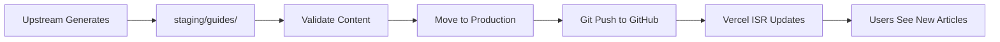

# 📁 Content Repository Setup & Workflow Guide

## 🎯 **Why Content Repository is Essential**

Your ISR architecture **requires** content to be on GitHub because:
- ✅ **Build-time fetching**: Vercel downloads content during build
- ✅ **Runtime ISR**: New articles are fetched on-demand 
- ✅ **Revalidation**: Content updates every hour
- ✅ **Fallback**: Local files used during development

**Without GitHub content = No articles will load!** 🚨

## 🚀 **Quick Setup (3 Steps)**

### **Step 1: Create GitHub Repository**
1. Go to [GitHub.com](https://github.com/new)
2. Repository name: `nextjs-deepv-content`
3. Set as **Public** (recommended) or **Private** (needs token)
4. **Don't** initialize with README
5. Click **"Create Repository"**

### **Step 2: Setup Content Repository**
```bash
# Run the automated setup script
npm run setup:content-repo
```

This script will:
- Initialize Git in content directory
- Add GitHub remote
- Create proper .gitignore
- Commit all content
- Prepare for push

### **Step 3: Push to GitHub**
```bash
# Navigate to content repository
cd ../nextjs-deepv-content

# Push to GitHub
git push -u origin main
```

## 🔄 **Updated Upstream Workflow**

### **New Output Locations:**

**Before (Main Repo):**
```bash
❌ /nextjs-deepv-docs/content/staging/guides/
❌ /nextjs-deepv-docs/content/staging/config/
```

**After (Content Repo):**
```bash
✅ /nextjs-deepv-content/staging/guides/
✅ /nextjs-deepv-content/staging/config/
```

### **Upstream Configuration Update:**

```bash
# Update your upstream workflow environment variables
export CONTENT_REPO_PATH="/path/to/nextjs-deepv-content"
export STAGING_GUIDES_DIR="${CONTENT_REPO_PATH}/staging/guides"
export STAGING_CONFIG_DIR="${CONTENT_REPO_PATH}/staging/config"
export PRODUCTION_GUIDES_DIR="${CONTENT_REPO_PATH}/guides"
export PRODUCTION_CONFIG_DIR="${CONTENT_REPO_PATH}/config"
```

### **Complete Workflow Steps:**

#### **1. Generate Articles (Upstream)**
```bash
# Your upstream generates articles to content repository
./generate-articles.sh
# Output: /nextjs-deepv-content/staging/guides/*.mdx
# Output: /nextjs-deepv-content/staging/config/article-index-update.json
```

#### **2. Validate Content**
```bash
# Validate staging content (same process as before)
cd /nextjs-deepv-content
./validate-staging.sh staging/
```

#### **3. Deploy to Production**
```bash
# Move from staging to production (within content repo)
cd /nextjs-deepv-content

# Copy validated content
cp staging/guides/*.mdx guides/
cp staging/config/article-index-update.json config/article-index.json

# Clean staging area
rm staging/guides/*.mdx
rm staging/config/article-index-update.json

# Commit and push to GitHub
git add .
git commit -m "Add new articles: $(date '+%Y-%m-%d %H:%M')"
git push origin main
```

#### **4. Website Auto-Update**
```bash
# Website automatically detects changes within 1 hour (ISR)
# For immediate updates, trigger manual revalidation:
curl -X POST "https://your-app.vercel.app/api/revalidate?secret=YOUR_SECRET"
```

## 🔧 **Environment Variables Setup**

### **In Vercel Dashboard:**
```bash
CONTENT_REPO_URL=https://api.github.com/repos/thaddeus-git/nextjs-deepv-content
GITHUB_TOKEN=your_personal_access_token_here  # Optional but recommended
```

### **Creating GitHub Token (Optional but Recommended):**
1. Go to [GitHub Settings > Tokens](https://github.com/settings/tokens)
2. Click **"Generate new token (classic)"**
3. Select scopes:
   - `public_repo` (for public repositories)
   - `repo` (for private repositories)
4. Copy the token and add to Vercel environment variables

## 📊 **Content Repository Structure**

```
nextjs-deepv-content/
├── README.md                 # Repository documentation
├── .gitignore               # Git ignore file
├── config/
│   ├── article-index.json   # 🔥 PRODUCTION article index
│   └── categories.json      # Category configuration
├── guides/
│   ├── article-1.mdx       # 🔥 PRODUCTION articles
│   ├── article-2.mdx
│   └── ... (100,000+ articles)
└── staging/
    ├── guides/             # 📝 NEW articles from upstream
    └── config/
        └── article-index-update.json  # 📝 UPDATED index
```

## 🎯 **Content Lifecycle**



## 🚨 **Important Notes**

### **Two Repositories to Manage:**
1. **Code Repository**: `nextjs-deepv-docs` (push code changes)
2. **Content Repository**: `nextjs-deepv-content` (push content changes)

### **Content Changes Trigger ISR:**
- New articles appear within 1 hour (automatic)
- Immediate updates via revalidation API
- No full site rebuild needed

### **Development vs Production:**
- **Development**: Uses local content files as fallback
- **Production**: Fetches from GitHub repository
- **ISR**: Generates pages on-demand, caches for performance

## 🎉 **Benefits of This Workflow**

### **Scalability:**
- ✅ Handle 100,000+ articles
- ✅ Fast deployments regardless of content size
- ✅ No build timeouts

### **Performance:**
- ✅ Only featured articles pre-rendered
- ✅ Other articles generated on-demand
- ✅ Content cached at edge for speed

### **Maintainability:**
- ✅ Clear separation of code vs content
- ✅ Independent version control
- ✅ Team permissions (dev team vs content team)

### **Reliability:**
- ✅ Content changes don't break deployments
- ✅ Fallback to local files during development
- ✅ Gradual rollout of new articles

## 🔍 **Troubleshooting**

### **Articles Not Loading:**
1. Check content repository exists on GitHub
2. Verify environment variables in Vercel
3. Check GitHub token permissions
4. Test content fetcher locally

### **Build Failures:**
1. Verify article index format
2. Check MDX file structure
3. Ensure staging validation passed
4. Review Vercel build logs

### **Content Not Updating:**
1. Confirm Git push to content repository
2. Wait for ISR revalidation (up to 1 hour)
3. Trigger manual revalidation if needed
4. Check article metadata format

## ✅ **Setup Checklist**

- [ ] Created `nextjs-deepv-content` GitHub repository
- [ ] Ran `npm run setup:content-repo`
- [ ] Pushed content to GitHub with `git push -u origin main`
- [ ] Updated Vercel environment variables
- [ ] Updated upstream workflow to use content repository paths
- [ ] Tested article generation and validation
- [ ] Verified ISR content fetching works

**Once complete, your content workflow is infinitely scalable!** 🚀